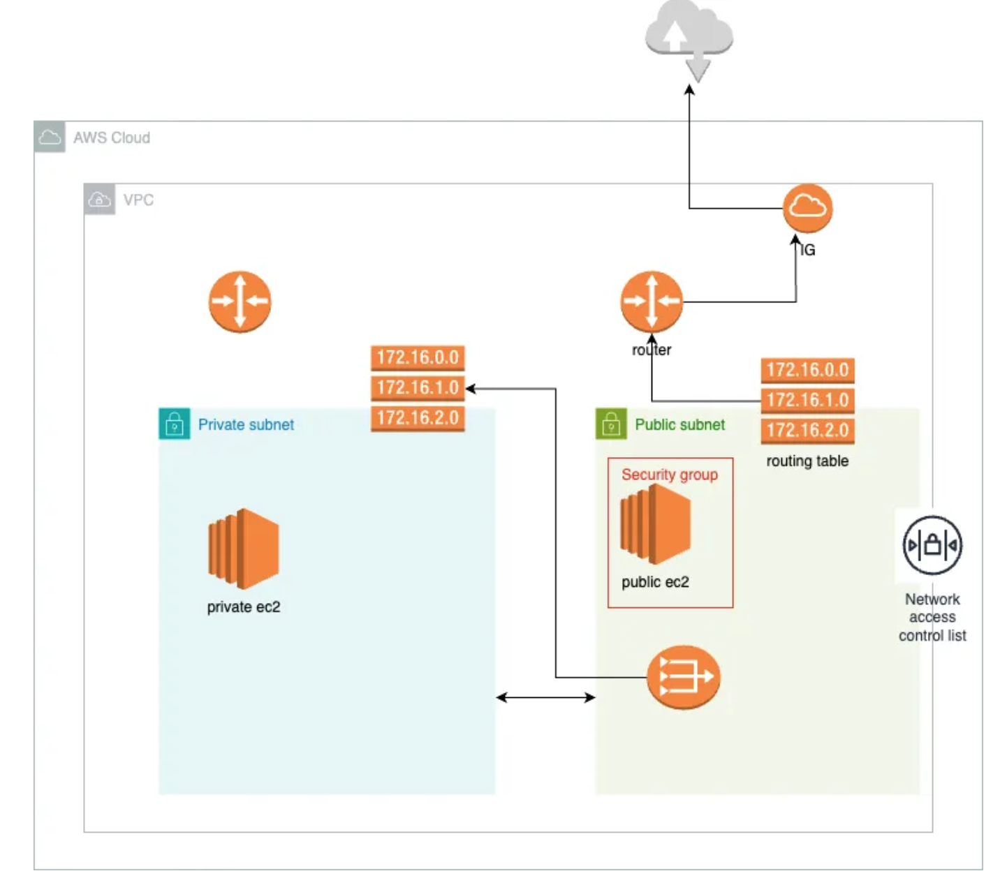

# Deploy EC2 instances with terraform in a vpc
- Set up the architecture below using terraform

## The architecture
- 2 EC2 instances.
- One instance on a public subnet
- The second instance on a private subnet.
- EC2 instance in a public subnet has a public IP to connect to the Internet, if there is an Internet gateway for VPC and a route from the subnet to the Internet gateway.
- The private EC2 instance doesnot have a public IP, making it unreachable from the Internet
- NAT gateway in the public subnet and assign it a static IP(Elastic IP).- To enable instances in private subnet to access the internet and download patches.
- Routes for the private subnet to communicate with NAT


[](architecture.png)

### Terraform setup
#### Backend
- To store state file
- To configure a remote backend with s3 and Dynamodb, use the snippet below
```sh
terraform {
  backend "s3" {
    bucket         = "bucket-name"
    key            = "tfstate/terraform.tfstate"
    region         = "aws-region"
    encrypt        = true
    dynamodb_table = "dynamodb-table"
  }
}
```

#### The following resources will be created
- VPC
- 2 Subnets (public & private)
- Internet gateway
- NAT gateway
- Route tables
- Route table associations
- Security groups
- 2 EC2 instances
- Ability to SSH into these instances

#### Running the service
- Obtain your account access key and secret key from aws
- Navigate to terminal and configure the cli
```sh
    export AWS_ACCESS_KEY_ID="access-key-id"
    export AWS_SECRET_ACCESS_KEY="access-key-secret"
```
- Manually create the s3 bucket and dynamodb table
- Configure the above resources as the remote backend to store and lock the state file respectively.
- Run the following terraform commands
```sh
  - terraform init
  - terraform plan
  - terraform apply
```

### Teardown Resources
- You can remove the created resources by running the following command, to eliminate extra costs
```sh
  terraform destroy
```